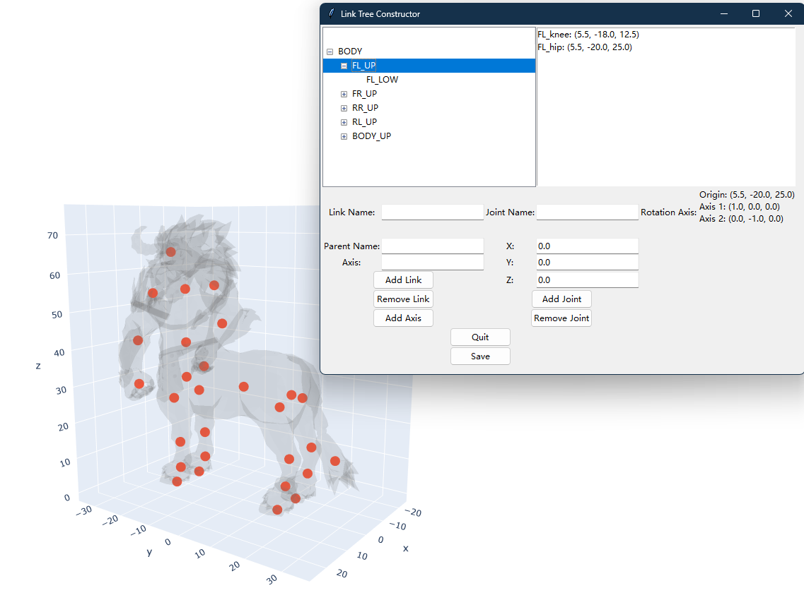
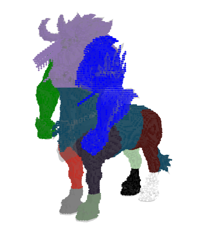
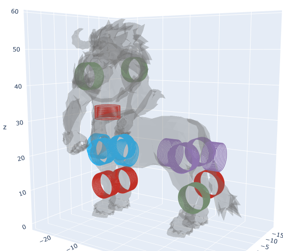

# Auto Design

This is a simple project to automatically generate a robot design from a 3D mesh. 

## Installation

## Usage
The following command will run the entire process of designing a robot from a 3D mesh.
```bash
python ./autodesign/auto_design.py
```

It will load the mesh from the file and provide the API to custumize the desired joints and links. 

__NOTE__: The Root Link must be named "BODY" and the name of the contact joints to the ground must contain "foot".

After you have the desired configuration, you can save the configuration to a file and press "quit" to proceed to the next step.



You will then see the decomposition of the mesh into links:



The motor optimization will start and you will see the results once it is done:



