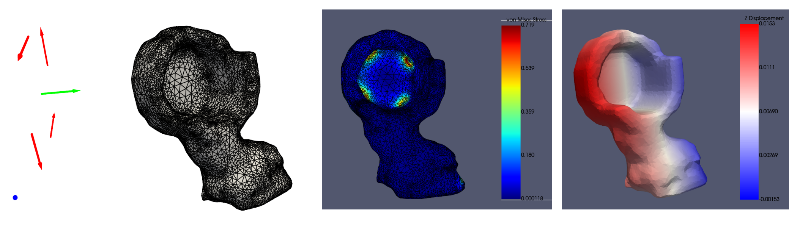
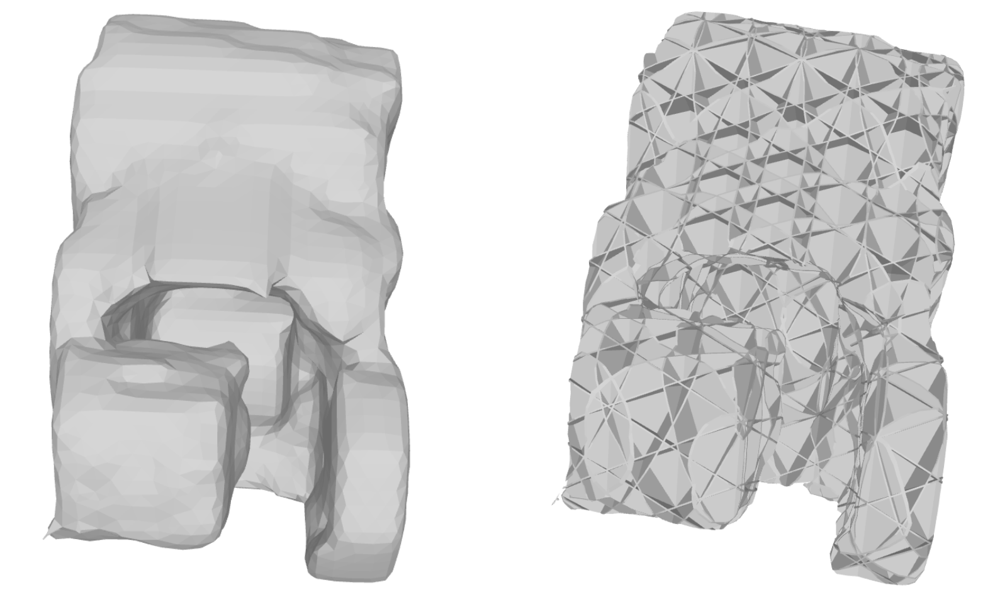

# Metamaterial filling
## Introduction
This repo is designed to do FEA analysis and fill meta-material to a given .stl mesh file. We use C++ and Python for different modules. 

- Tested environment: Ubuntu 20.04 with ROS Neotic installed.


## Installation
We use [libigl](https://libigl.github.io/) for mesh operations using c++ and [solidpython](https://github.com/SolidCode/SolidPython) ([openscad](https://openscad.org/) + python interface) for 3D modeling. libigl is a head-only library. We have placed libigl in the include folder. libigl relies on Eigen so we also put Eigen in the include file. (In a public version, these libraries will be placed as a git submodule).


 - Create a conda environment
```
conda create --name robot_design python=3.8
conda activate robot_design
pip install open3d
```

- Install openscad and solidpython. Run the following command
```
sudo apt-get install openscad
pip install solidpython
```

- Install CGAL. By default this will install CGAL 5.0.2-3. when using Ubuntu 20.04.
```
sudo apt-get install libcgal-dev
```

- Install meshio by
```
pip install meshio[all]
```

- Install Ansys 2023 R2 (Note: Student edition can't be installed in Ubuntu. Make sure you have the license). To install Ansys on ubuntu, first, install the dependencies shown below. Then follow the official instructions of Ansys to install it in Ubuntu. __NOTE__: Use the default ```/root/ansys_inc``` folder to install. Install only MAPDL is sufficient. Finally, install PyAnsy.
```
sudo apt install ubuntu-desktop alien freeglut3 libxcb-xinerama0 lsb xterm libmotif-common  libmotif-dev
```
```
Install MAPDL on your ubuntu system
```
```
python -m pip install pyansys
```


- Then clone the code to your PC and compile the C++ part.

```
cd catkin_ws/src
git clone git@github.com:Anything-robot/metamaterial_filling.git

cd metamaterial_filling
mkdir build
cd build
cmake ..
make

cd ../..
git clone git@github.com:Anything-robot/auto_design.git
```
Repo auto_design is required to read the torque pkl file for FEA analysis. Eigen and igl have been packed in the include folder to make sure the right version is used.

## Quick Use

### FEA Analysis

```
cd metamaterial_filling
python script/user_stl_force_relative_density_fea_opt.py --input_stl_path data/stl_file_path --unit m --robot_result_file torque_pkl_file_path
```
__NOTE__: The input stl file has to be in the folder data or its subfolder. The unit 'm' or 'mm' needs to set. There are many other parameters that specify the material property, meshing accuracy, optimization rate, etc. in ```user_stl_force_relative_density_fea_opt.py```. Check and change them if needed.

If you set ```--display_fea_result True --display_force_result True```. You will see the following images when the code is running. From left to right, the image shows (1) the fixed position (blue), and torque direction arrow (green) and the decomposed force arrows (red), (2) the meshing result, (3) von Mises stress, (4) displacement result.



This script receives the stl file, the defined tenon positions and torques from a pkl file. Then turn the torques to forces and do fea analysis to find the best metamaterial density.The result will be shown in the command window and also stored in a pkl file in ```data/output``` folder as file_name_fea_result.pkl. To read the result, check example in ```script/example_read_fea_result.py```.


### Metamaterial Filling
We use [six-fold plate](https://www.sciencedirect.com/science/article/pii/S2352431619302640) as the metamaterial type.
```
cd metamaterial_filling
python script/stl_metamaterial_filling.py --input_stl_path data/stl_file_path --unit m --relative_density 0.15 --shell_thickness 0.2 --output_stl_name out_file.stl
```
__NOTE__: The input stl file has to be in the folder data or its subfolder. The unit 'm' or 'mm' needs to set. The result will be saved in ```data/output``` folder with the given output_stl_name.

The result stl file composed of: 1) shell with the given thickness. 2) six-fold plate inside, as the following image shows:



## Run Individual tools
We offer the following tools.

- __Fill a mesh with cube boards__. Check ```filling.cpp``` (__Not very useful in realistic because not printable__).
- __Replace a mesh__ to align its center to origin and put the biggest face (x-y, y-z or x-z) to the bottom. Check ```replaceMesh.cpp```.
- __smallModelGeneration__. Check ```smallModelGeneration.cpp```. Currently, we generate a smaller model, the original model - shell, using the CGAL. Then the shell can later be acquired by doing bool operation original model - smaller model. We use SDF and CGAL::make_surface_mesh (marching_cubes + smooth) to get a watertight model. The input file is .stl and the output is .off format. When you set thickness to 0, this node theoretically can also be used as a node to denser or smooth the mesh. __NOTE:__ For complex-shaped model and thin shell this tool may be a very long time and suffer from the memory explosion issue.
- __innerPointsCalculation__. Check ```innerPointsCalculation.cpp```. This is an alternative way to generate a smaller model. Run this first to generate a bin file storing the points inside the mesh, with a given thickness. Then run ```script/metamaterial/generateMeshFromPoints.py``` to use marching-cubes to get the stl model. Compared to __smallModelGeneration__, this pipeline is much faster but has lower accuracy because we don't do interpolation between voxels to find a vertex.
- __6-fold plates filling__. Run ```sixFoldPlatesFilling.py``` to fill a six fold plate in to a .stl mesh file. This may take a long time for rendering and a big memory consumption.
- __tetrahedralMeshing__. Check ```tetrahedralMeshing```. This is used to generate mesh for FEA. The result is a .vtu file. 
- __Mesh format tranformation__. Use scripts in ```script/format_transform```. Most of the scripts use MESHIO. But MESHIO doesn't really support .msh mesh used in Ansys. So I wrote the script ```vtu_to_ansys_msh.py``` by myself.
- __Fill STL Surface Mesh to get IGES Volume Mesh__. Check ```script/freecad/stl_to_iges.py```. __NOTE__: This doesn't work for complex shaped objects!
- __FEA with PyAnsys__. 1) Check ```script/pyansys/mapdl_analysis.py```. The input should be an .iges volume mesh. (Use ```script/freecad/stl_to_iges.py``` to fill STL Surface Mesh to get IGES Volume Mesh). 2) __Suggested__: Generate a .vtu mesh with ```tetrahedralMeshing```. Then convert to .msh file used for Ansys with ```vtu_to_ansys_msh.py```. Finally, use ```mapdl_msh_analysis.py``` to do FEA with the msh file directly.
- __Check if an OFF mesh is water tight__ See ```checkIfWatertight```. Run by ```./checkIfWatertight [off_file_path]```.


```
# EXAMPLE
./tetrahedralMeshing '../data/FL_replaced_scaled.off' '../data/FL_replaced_scaled.vtu' 10000 0.5

python script/format_transform/vtu_to_ansys_msh.py 'data/FL_replaced_scaled.vtu' 'data/FL_replaced_scaled.msh'

python script/pyansys/mapdl_msh_analysis.py 'data/FL_replaced_scaled.msh'
```